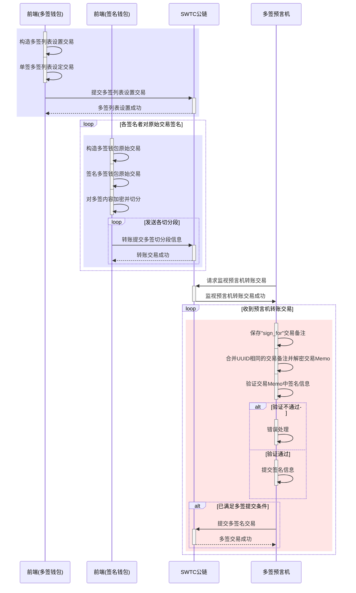

### 需求背景

当前 SWTC 链已经接受通过多签名提交 Transaction 交易的功能。具体操作过程如下：

1. 对需要被多签名控制的钱包，用该钱包发起一笔设定该钱包多签名列表的交易（"TransactionType": "SignerListSet"）并发送到链上。
2. 在设定多签名列表交易成功后，用设定的多签名列表中的钱包在线下对被控制钱包的 Transaction 交易进行签名，并将签名信息通过线下传递给最终汇总向 SWTC 链提交的提交者。
3. 汇总提交者在收到足够多（已签名者权重之和超过设定多签名列表时设定的阈值）的签名者信息后，将被控制钱包的原始 Transaction 交易连同各个签名者签名后的摘要签名信息一起发送到链上。
4. SWTC 链验证最终提交者提交的原始 Transaction 交易内容与各个签名者签名后的签名信息的一致性，以及签名权重是否足够，全部通过后原始 Transaction 交易成功。

从上面过程可以看到：

1. 需要被多签名控制的钱包向 SWTC 链发出设定多签名列表交易，一般使用者没有构造这种 Transaction 交易内容的能力。
2. 各个签名者在对被控制钱包的多签交易进行签名时，需要构造出被控制多签钱包的原始 Transaction 交易信息，这种交易信息构造对于一个普通用户来说比较困难。
3. 对多签名交易的签名信息收集、汇总只能通过线下处理，会存在错误、丢失、遗漏风险，从而导致最终提交多签名交易时交易不成功的情况。

### 方案内容

综合[需求背景](#%e9%9c%80%e6%b1%82%e8%83%8c%e6%99%af)中的问题，考虑提供如下服务解决用户使用 SWTC 链多签服务中的难点和痛点：

##### 交易构造（前端）

1. 提供 SWTC 链交易内容构造功能，根据交易类型的不同，按照 SWTC 链的要求构造对应的交易内容。
2. 在前端本地提供对交易内容进行本地单签、多签的功能。
3. 对于单签交易，提供直接将签名后内容向 SWTC 链提交的功能。
4. 对于多签交易：
   - 将签名前交易内容、签名后签名信息拼接后通过某个预言机钱包（可配置）公钥进行加密；
   - 将加密后内容文本按照每 1900 字符分为 N 个部分（最后第 N 段可能不足 1900 字符）；
   - 用 UUID 算法，生成本次操作的 32 位 UUID 码；
   - 在每切分段的头部添加备注类型（"sign_for"）、UUID 码、本切分段编号、切分段总数信息；
   - 对每切分段，将上述信息拼接后作为转账交易备注（Memo），向预言机钱包发送 N 笔 75 个 SWTC 或者 1 个 JCC（可配置）的转账交易，将多签过程信息上链。
5. 展示某个多签交易当前已经收集到的签名信息，此处需要浏览器支持。

此外前端亦需要提供创建多签钱包的接口。

##### 多签收集提交（预言机）

1. 预言机不断监控预言机钱包（可配置）的 75 个 SWTC 或者 1 个 JCC（可配置）以上的转账交易，对交易备注满足下面要求的转账交易，将交易备注记录下来。
   - 交易备注的备注类型为"sign_for"；
2. 对转账交易发送钱包+UUID 相同的交易备注，当收到全部的 1~N 个多签切分段后，按照切分段顺序将 N 个切分段内容合并后用预言机钱包私钥解密。
   - 对某个切分段 m，当收到多个时，以最先收到的那个为准，其他的交易作为异常数据记录；
   - 对于 1 天内（可配置）仍未收到全部 N 个切分段的交易，将已收到的交易均作为异常数据记录；
   - 对于私钥解密失败的交易，将 N 个交易均作为异常数据记录；
3. 根据解密得到的被签名交易内容中的原始钱包（Account），从链上查询该钱包的多签名钱包列表信息，以及该钱包的当前 sequence。
4. 对多签信息做验证，对于验证不通过的多签信息做异常记录。
   - 验证多签信息的提交者（Signer.Account），是否在被签名钱包的多签名钱包列表中。
   - 验签：使用被签名钱包的原始交易内容、签名钱包提交的签名信息（Signer.SigningPubKey、Signer.TxnSignature）做签名匹配验证。
   - 验证多签原始交易中的 sequence，是否 ≥ 被签名钱包的当前 sequence。
5. 多签交易提交。
   - 当被签名钱包的某个交易的正确签名者的权重（SignerWeight）之和 ≥ 签名列表设定的阈值（SignerQuorum）时、预言机自动将原始交易内容、收集到的正确签名者签名信息组装成 SWTC 链需要的多签交易，并向 SWTC 链提交
   - 当同一个多签名钱包的多笔多签交易同时满足提交条件时需要按照原始交易的 sequence 顺序从小到大顺序提交。
   - 记录 SWTC 链返回的提交结果。

### 时序图



### Memo 数据格式

转账交易备注（Memo）加密切分前数据格式：

1. Memo 数据包含：签名前交易 tx_json、签名后交易 Signer 三部分；
2. 两部分数据都做 json 压缩，去掉不必要的空格；
3. 两者之间用"|"（半角竖线）分割；
4. 数据示例如下：
   ```
   "tx_json":{"TransactionType":"Payment","Account":"jpfYA6g6XhZ2Szr5i9HURvs8jAybYbZmcA","Destination":"jUYaanwMxMvCqmmZz6tyUtnMnmmwLaikbZ","Amount":41000000,"Sequence":23,"Fee":20,"SigningPubKey":""}|"Signer":{"Account":"jEiAtrX9qtT6jteSpPhLhZCy5PiZQ23jkh","SigningPubKey":"02AFAB78AF0D557D55822B8B6AB2F74B89B91B8FC5C3DF10D701B485AE90BD2622","TxnSignature":"3045022100E070733238F2786EAD2E61F126380F06CB2B29FB9593B8B17BB34A9080ABF14D022020AFF8F812C38F8B05E70D1AC24610D93CE58C532CF9DCD73D5C857CAF3596EC"}
   ```
5. 数据长度：
   - 签名前交易 tx_json: 最大 988("TransactionType":"SignerListSet"时，可以指定 8 个 SignerEntry，此时交易内容最长。即使所有 11 个整数字段取最大值，总长度不会超过 1200)
   - 签名后交易 Signer:303 或 305(Account、SigningPubKey 固定，TxnSignature 为 140 或者 142)

向预言机钱包发送的转账交易备注（Memo）加密切分后数据格式：

1. Memo 数据包含：备注类型、UUID、当前切分块序号、切分块总数、当前切分块内容；签名前交易 tx_json、签名后交易 Signer 三部分；
2. 五部分数据之间用"|"（半角竖线）分割；
3. 数据示例如下：
   ```
   sign_for|27274c88673911eaae330221860e9b7e|02|09|120007220000000024000001B364D4C4F94AE6AF80000000000000000000000000004353500000000000A582E432BFC48EEDEF852C814EC57F3CD2D4159665D447A8DEDE22C000000000000000000000000000434E590000000000A582E432BFC48EEDEF852C814EC57F3CD2D4159668400000000000000...(1900字节)...C2BC05E6C82F38DEFF8583BCD022072B490844539FEA686F7D0ED7AE922723DED6F087A1DE598934BAD36824EBBB6811434F9B6EDDD3716AE7B0889A16CA8811D8255E0D68D14896E3F7353697ECE52645D9C502F08BB2EDC5717
   ```
4. 数据长度：
   - 备注类型(sign_for)：8（固定）
   - UUID: 32（固定）
   - 当前切分块序号：2（固定，不足两位前面补 0）
   - 切分块总数：2（固定，不足两位前面补 0）
   - 当前切分块内容：最大 1900（最后一个切分块可能会小不足 1900）
   - 当前 SWTC 链备注为 2K，可以容纳三部分数据最大长度

### 预言机需要的注意点

预言机监控的是某个钱包的转账交易，那么可以收到不是经过交易构造前端发过来的交易。通过引入 UUID，并采用最先受到的交易备注，黑客伪造前端向预言机发送多签交易，应该不能产生大的影响，但是可能导致预言机不正确的将不应该向 SWTC 链提交的多签名提交，导致以前的多签操作失效，因此还是需要注意被攻击的风险。

1. 发送的转账交易备注中多签内容用预言机钱包公钥签名，防止其他人猜测备注中内容格式，也防止多签交易内容泄露。
2. 预言机在向 SWTC 链提交之前做些力所能及的验证，尽量避免无谓的提交。
3. 向 SWTC 链提交的多签交易，也不一定能保证一定成功，因为还有 GAS 费不足，以及其他导致交易 sequence 不对等各种情况。
4. 收到的各个多签信息分组的依据：
   - 原始交易钱包地址
   - 原始交易的 sequence
5. 对于同一个原始交易内容，如果签名者发送多次签名信息过来，以最后收到的那个签名信息为准。
